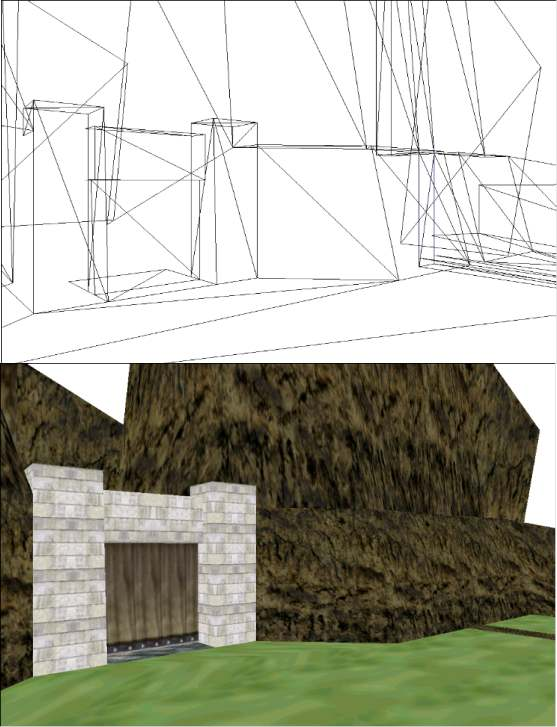



## Game Editor 3D DX

### Description

Its a CAD in which you can create 3D worlds using DirectX 8. Its a future project for the game World of Magic. But like im a bit stuck i need some help. Includes two maps and other cool options. Dont vote, help me. I couldnt upload the file to PSC so please download it from: http://andres_zacarias.tripod.com/Code.zip
 
### More Info
 

             |
---                |---
**Submitted On**   |2002-03-27 12:59:46
**By**             |[Andres Zacarias](https://github.com/Planet-Source-Code/PSCIndex/blob/master/ByAuthor/andres-zacarias.md)
**Level**          |Beginner
**User Rating**    |5.0 (20 globes from 4 users)
**Compatibility**  |VB 6\.0
**Category**       |[DirectX](https://github.com/Planet-Source-Code/PSCIndex/blob/master/ByCategory/directx__1-44.md)
**World**          |[Visual Basic](https://github.com/Planet-Source-Code/PSCIndex/blob/master/ByWorld/visual-basic.md)
**Archive File**   |[Game\_Edito659573272002\.zip](https://github.com/Planet-Source-Code/andres-zacarias-game-editor-3d-dx__1-33123/archive/master.zip)

